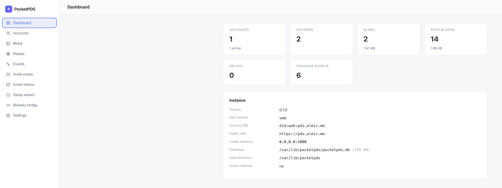

# PocketPDS

[](https://github.com/alesr/pocketPDS/actions/workflows/ci.yml)
[](https://go.dev)
[](LICENSE)

A single-binary Personal Data Server for the [AT Protocol](https://atproto.com).
One Go binary, one SQLite file, no external services.

## What it does

- **Accounts.** Sign-ups with a `did:web` or `did:plc` identity; the PDS
  generates the keys and hosts the DID document.
- **Signed repos.** Posts, follows, likes, and blocks live in a Merkle Search
  Tree, and every change is signed, so relays can verify the data is yours.
- **Sync and firehose.** Relays pull your repo as a CAR (full or incremental)
  and stream live updates over `subscribeRepos`.
- **AppView.** A small `app.bsky.*` read API, so AT Protocol clients like
  [Graysky](https://graysky.app) read profiles and feeds straight from your
  PDS.
- **Bluesky bridge.** Link a bsky.social account and sync both ways: posts you
  write on bsky.social are archived into your PDS, and posts you write on your
  PDS are published to bsky.social. A Sync button in the admin panel does the
  round trip.
- **Admin panel.** A web dashboard at `/admin` with a setup wizard and tools
  for accounts, blobs, invite codes, app passwords, relays, and the bridge.

## Admin panel

`/admin` is a small operator console. The setup wizard walks through the
domain, the Cloudflare Tunnel, DNS, and the first account. The Bluesky bridge
section links a bsky.social account, sets a custom domain handle, and has the
Sync button. The rest covers accounts (records, commits, blobs, sessions, app
passwords, deactivate, delete), blob uploads, invite codes, relays and crawl
requests, email tokens, a live firehose stream, settings, and diagnostics.



## Install

Build from source (Go 1.26+):

```bash
go build ./cmd/pocketpds
POCKETPDS_SECRET=<long-random-string> POCKETPDS_DB=./pocketpds.db ./pocketpds -seed
```

Or run the container:

```bash
docker run -d --name pocketpds \
  -e POCKETPDS_SECRET=<long-random-string> \
  -p 3000:3000 \
  -v pocketpds-data:/data \
  ghcr.io/alesr/pocketpds:latest
```

`POCKETPDS_SECRET` is required.

## Docs

- [Getting started](docs/getting-started.md): build, run, API examples, config.
- [Self-host runbook](build/README.md): Tailscale, Cloudflare Tunnel, DNS, and
  the setup wizard.

## Design

Built on [bluesky-social/indigo](https://github.com/bluesky-social/indigo).
Writes go through its `repo` package, which builds the Merkle Search Tree and
signs commits. Reads and sync go through `atproto/repo` and
`atproto/identity`. Blocks are stored as DAG-CBOR in a SQLite blockstore
([modernc.org/sqlite](https://pkg.go.dev/modernc.org/sqlite)), with a
denormalized `repo_records` index backing `getRecord` and `listRecords`.

## License

[MIT](LICENSE)
